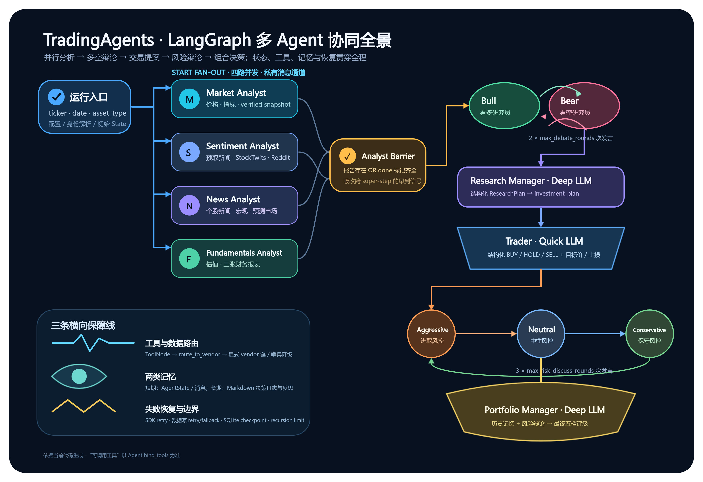
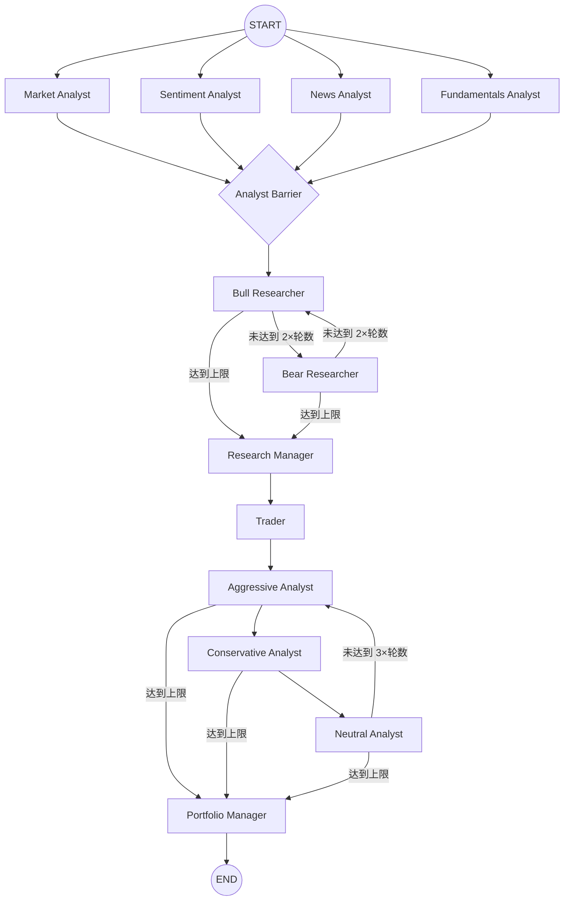
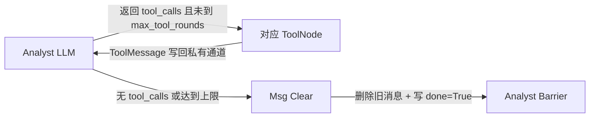
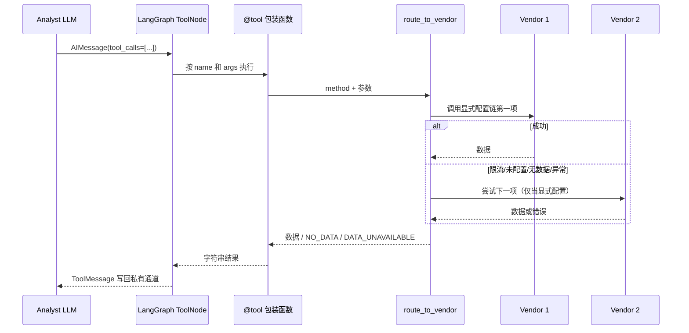
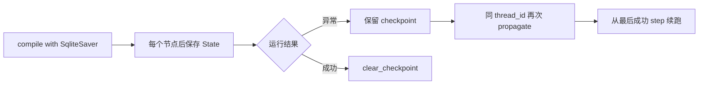
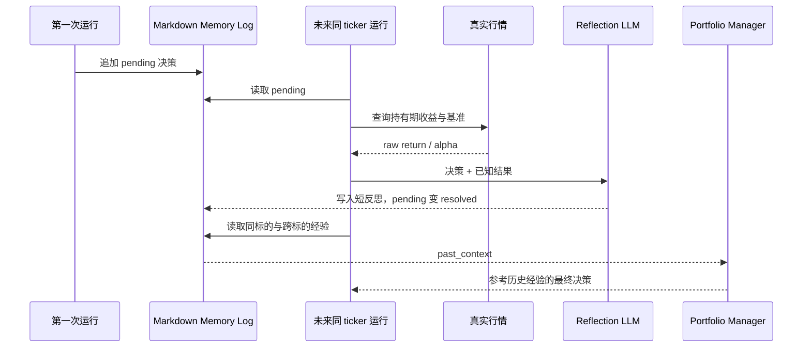

# TradingAgents 项目学习与实现指南

> 适用版本：仓库当前代码（`pyproject.toml` 标记为 v0.3.1）
> 文档目标：帮助读者从“会运行”进阶到“能解释、能调试、能扩展 LangGraph 多 Agent 流程”。
> 阅读建议：先读第 1～4 章建立全局模型，再按第 16 章的路线结合源码调试。

## 目录

1. [一句话理解项目](#1-一句话理解项目)
2. [全局架构图](#2-全局架构图)
3. [目录和模块职责](#3-目录和模块职责)
4. [一次分析如何启动](#4-一次分析如何启动)
5. [LangGraph 状态模型](#5-langgraph-状态模型)
6. [LangGraph 图如何装配](#6-langgraph-图如何装配)
7. [四类分析师如何协作](#7-四类分析师如何协作)
8. [多空研究、交易和风控流程](#8-多空研究交易和风控流程)
9. [Agent 之间到底传什么](#9-agent-之间到底传什么)
10. [工具调用和数据 Vendor 路由](#10-工具调用和数据-vendor-路由)
11. [LLM 客户端与结构化输出](#11-llm-客户端与结构化输出)
12. [记忆如何管理](#12-记忆如何管理)
13. [失败、重试、降级和恢复](#13-失败重试降级和恢复)
14. [输出、日志和可观测性](#14-输出日志和可观测性)
15. [当前实现中需要特别注意的事实](#15-当前实现中需要特别注意的事实)
16. [推荐学习路线](#16-推荐学习路线)
17. [如何扩展项目](#17-如何扩展项目)
18. [测试地图与调试清单](#18-测试地图与调试清单)

---

## 1. 一句话理解项目

TradingAgents 把一次证券或加密资产分析拆成五个阶段：

1. 四类分析师并发收集和解释证据；
2. Bull 与 Bear Researcher 围绕证据进行多空辩论；
3. Research Manager 裁决并生成研究计划；
4. Trader 把研究计划变成可执行交易提案；
5. 三类风险分析师从不同风险偏好辩论，Portfolio Manager 结合历史经验给出最终五档评级。

LangGraph 负责的不是“让模型变聪明”，而是把这些角色变成一个可控状态机：定义节点、边、条件路由、循环次数、并发汇合、状态合并和检查点恢复。http://8.138.47.45:5000/

可以用下面的等式理解整个项目：

```text
TradingAgents
= LangGraph 状态机
+ 角色化 Prompt / LLM
+ LangChain ToolNode
+ 可插拔金融数据 Vendor
+ 短期 State + 长期决策日志
+ 重试 / 降级 / 检查点
```

## 2. 全局架构图



图的源文件和可编辑中间产物：

- [`diagram.svg`](diagrams/2026-09-01T233540/diagram.svg)：主源文件；
- [`diagram.json`](diagrams/2026-09-01T233540/diagram.json)：可导入画板的 OpenAPI 节点结构；
- [`diagram.png`](diagrams/2026-09-01T233540/diagram.png)：阅读版图片。

主业务流可以简化为：



## 3. 目录和模块职责

| 路径                                  | 核心职责                          | 学习重点                                            |
| ------------------------------------- | --------------------------------- | --------------------------------------------------- |
| `main.py`                           | 最小程序化调用示例                | `TradingAgentsGraph().propagate()`                |
| `cli/`                              | Typer + Rich 交互式终端           | 流式消费图状态、Agent/工具统计、报告保存            |
| `web/`                              | FastAPI + 静态前端                | 后台任务、分析状态轮询、模型配置、报告历史          |
| `tradingagents/default_config.py`   | 默认配置和环境变量覆盖            | 配置优先级、类型转换、运行边界                      |
| `tradingagents/graph/`              | LangGraph 编排核心                | StateGraph、节点、边、条件路由、Barrier、checkpoint |
| `tradingagents/agents/analysts/`    | 四类证据分析师                    | 工具循环、预取数据、报告字段                        |
| `tradingagents/agents/researchers/` | Bull / Bear 多空研究员            | 共享辩论状态、轮流发言                              |
| `tradingagents/agents/managers/`    | Research / Portfolio Manager      | Deep LLM、结构化裁决、历史记忆注入                  |
| `tradingagents/agents/trader/`      | 交易员                            | 把研究计划转成交易动作和价位                        |
| `tradingagents/agents/risk_mgmt/`   | 三种风险偏好辩手                  | 循环路由和立场对抗                                  |
| `tradingagents/agents/schemas.py`   | Pydantic 输出 Schema              | 约束评级、动作、目标价、止损、置信度                |
| `tradingagents/agents/utils/`       | 工具包装、State、记忆、结构化回退 | Agent 与基础设施的连接层                            |
| `tradingagents/dataflows/`          | 数据 Vendor 抽象与实现            | 显式 Vendor 链、异常分类、哨兵降级、符号规范化      |
| `tradingagents/llm_clients/`        | 多模型提供商适配                  | 工厂、能力表、OpenAI 兼容层、推理参数               |
| `tradingagents/reporting.py`        | 报告树输出                        | 最终 State 到 Markdown 文件的映射                   |
| `scripts/`                          | 健康检查、冒烟、回测、复现脚本    | 用小脚本验证单条技术假设                            |
| `tests/`                            | 单元和回归测试                    | 理解项目真实契约的第二来源                          |

### 3.1 `graph/` 内部模块

| 模块                     | 职责                                                                                       |
| ------------------------ | ------------------------------------------------------------------------------------------ |
| `trading_graph.py`     | 门面类。创建 LLM、ToolNode、Memory、GraphSetup；运行图；写状态日志；处理检查点和最终信号。 |
| `setup.py`             | 真正装配 StateGraph：注册节点、普通边和条件边；实现并发分析师 Barrier。                    |
| `conditional_logic.py` | 三类路由：分析师工具循环、多空辩论循环、风险辩论循环。                                     |
| `analyst_execution.py` | 把分析师 wire key 映射成节点名、消息通道、报告字段和完成标记。                             |
| `propagation.py`       | 创建初始`AgentState`，设置 `recursion_limit` 和 stream 参数。                          |
| `checkpointer.py`      | 每 ticker SQLite 检查点、thread id、查询和清除。                                           |
| `reflection.py`        | 在历史收益已知后，让 quick LLM 生成简短复盘。                                              |
| `signal_processing.py` | 从 Portfolio Manager Markdown 中确定性解析五档评级，不再调用 LLM。                         |

## 4. 一次分析如何启动

### 4.1 推荐的程序化入口

```python
from tradingagents.default_config import DEFAULT_CONFIG
from tradingagents.graph.trading_graph import TradingAgentsGraph

config = DEFAULT_CONFIG.copy()
config["checkpoint_enabled"] = True

graph = TradingAgentsGraph(
    selected_analysts=("market", "social", "news", "fundamentals"),
    config=config,
)

final_state, rating = graph.propagate("600519.SS", "2026-08-14")
report = graph.save_reports(final_state, "600519.SS")
```

`propagate()` 是目前最完整的入口，它会执行：

```text
解析旧的 pending 决策
→ 可选地用 SqliteSaver 重新 compile 图
→ 读取长期记忆
→ 解析 instrument identity
→ 创建初始 AgentState
→ invoke / stream LangGraph
→ 写完整状态 JSON
→ 追加 pending 决策到长期日志
→ 成功后清理本次 checkpoint
→ 解析最终五档评级
```

### 4.2 初始化阶段

`TradingAgentsGraph.__init__()` 做了六件关键事情：

1. 合并默认配置、调用方配置和 `TRADINGAGENTS_DATA_VENDORS`；
2. 用 `set_config()` 把数据层运行配置写入模块级配置缓存；
3. 创建一个共享 `httpx.Client`，让 deep/quick LLM 复用连接池；
4. 通过 `create_llm_client()` 创建 deep 和 quick 两档模型；
5. 创建 Memory、ToolNode、条件路由、Propagator、Reflector；
6. `GraphSetup.setup_graph()` 返回 StateGraph，然后 `compile()` 得到可执行图。

模型分层如下：

| 角色              | 默认模型档位 | 原因                          |
| ----------------- | ------------ | ----------------------------- |
| 四类分析师        | quick        | 调用频繁、主要做数据解释      |
| Bull / Bear       | quick        | 多轮辩论，成本和延迟敏感      |
| Research Manager  | deep         | 要裁决冲突证据并形成计划      |
| Trader            | quick        | 任务边界清晰，有结构化 Schema |
| 三类风险分析师    | quick        | 多轮观点对抗                  |
| Portfolio Manager | deep         | 最终综合和高影响决策          |
| Reflector         | quick        | 只生成 2～4 句紧凑复盘        |

### 4.3 三个入口并不完全等价

| 入口               | 调用方式                                      | 长期记忆                           | Checkpoint                         | 报告                     |
| ------------------ | --------------------------------------------- | ---------------------------------- | ---------------------------------- | ------------------------ |
| `main.py` / 脚本 | `propagate()`                               | 完整                               | 按配置生效                         | 可调用`save_reports()` |
| Web                | 后台线程中调用`propagate()`                 | 完整                               | Web 强制开启                       | 自动保存                 |
| CLI                | 直接构造 state 后调用`graph.graph.stream()` | 当前未走`propagate()` 的记忆读写 | 当前未重新编译带 checkpointer 的图 | 用户确认后保存           |

这个差异非常重要：理解代码时不能假设所有入口都自动享有 `propagate()` 的前后处理。

## 5. LangGraph 状态模型

状态定义在 `tradingagents/agents/utils/agent_states.py`。`AgentState` 继承 `MessagesState`，同时增加业务字段。

### 5.1 状态分层

| 状态类别       | 字段                                                                                      | 主要生产者                        | 主要消费者                        |
| -------------- | ----------------------------------------------------------------------------------------- | --------------------------------- | --------------------------------- |
| 运行身份       | `company_of_interest`, `asset_type`, `instrument_context`, `trade_date`           | Propagator                        | 所有 Agent / 工具 Prompt          |
| 分析师消息     | `market_messages`, `sentiment_messages`, `news_messages`, `fundamentals_messages` | 各分析师和 ToolNode               | 对应分析师内部循环                |
| 分析师完成标记 | `market_done` 等                                                                        | Msg Clear 节点                    | Analyst Barrier                   |
| 分析报告       | `market_report`, `sentiment_report`, `news_report`, `fundamentals_report`         | 四类分析师                        | Bull / Bear / 风控 Agent          |
| 多空辩论       | `investment_debate_state`                                                               | Bull、Bear、Research Manager      | 条件路由、Trader                  |
| 研究计划       | `investment_plan`                                                                       | Research Manager                  | Trader、Portfolio Manager         |
| 交易提案       | `trader_investment_plan`                                                                | Trader                            | 三类风险分析师、Portfolio Manager |
| 风险辩论       | `risk_debate_state`                                                                     | 三类风险分析师、Portfolio Manager | 条件路由、最终报告                |
| 最终决策       | `final_trade_decision`                                                                  | Portfolio Manager                 | Memory、报告、SignalProcessor     |
| 长期经验输入   | `past_context`                                                                          | TradingMemoryLog                  | 只注入 Portfolio Manager Prompt   |

### 5.2 为什么四个消息通道必须隔离

四个分析师从 `START` 同时运行。如果共同写 `messages`，它们的 AIMessage、ToolMessage 和 tool call id 会交叉，出现以下问题：

- Market Agent 可能读到 News Agent 的工具结果；
- ToolNode 可能无法匹配正确的 tool call；
- 并发分支同时写普通字段时触发 `InvalidUpdateError`；
- Context 越来越大，成本和幻觉风险增加。

因此四个字段都使用 `Annotated[list, add_messages]` reducer。LangGraph 会按 message id 合并，而不是简单覆盖。

共享 `messages` 仍然存在，主要用于：

- 兼容旧 checkpoint 和直接调用 Agent 的测试；
- Trader 之后的顺序阶段；
- CLI/Debug 展示。Sentiment Analyst 和 Trader 会镜像写入共享通道。

### 5.3 辩论状态不是消息列表

`InvestDebateState` 和 `RiskDebateState` 使用普通 TypedDict 字段保存：

- 全部历史；
- 每个角色自己的历史；
- 最新发言人和最新回复；
- 当前发言计数；
- Manager 的裁决。

这些字段没有 reducer，所以同一个 super-step 内不能有两个节点并发写它们。这正是分析师 Barrier 必须阻止下游被重复触发的原因。

## 6. LangGraph 图如何装配

### 6.1 分析师执行计划

`build_analyst_execution_plan()` 把用户选择映射成 `AnalystNodeSpec`：

```text
wire key
→ Agent 节点名
→ Clear 节点名
→ ToolNode 名
→ report key
→ private messages key
→ done key
```

例如 `market` 被映射为：

```text
Market Analyst
Msg Clear Market
tools_market
market_report
market_messages
market_done
```

`social` 是为了保存配置兼容性保留的 wire key，用户可见节点已经改名为 `Sentiment Analyst`。

### 6.2 每个工具型分析师的内部循环



路由判断在 `ConditionalLogic._cap_reached()`：

1. 取对应消息通道最后一条消息；
2. 检查它是否带 `tool_calls`；
3. 统计该通道内带 tool call 的 AIMessage 数；
4. 小于 `max_tool_rounds` 才进入 ToolNode；
5. 否则强制进入 Clear 节点。

注意：“达到工具轮数上限”并不会额外再让 LLM 生成一次报告。当前 Agent 只有在本次响应没有 tool call 时才把 `result.content` 写入报告，所以在仍请求工具时被强制 Clear，报告可能为空；done 标记保证 Barrier 不会因此永久等待。

### 6.3 Clear 节点的作用

`create_msg_delete(messages_key, done_key)` 返回一个节点函数，它会：

1. 对当前私有通道所有消息生成 `RemoveMessage`；
2. 添加一条包含 ticker、identity 和日期的 HumanMessage 占位；
3. 把对应 `*_done` 写成 `True`。

它的目标是收缩临时 Context，并为 Barrier 提供确定的完成信号。占位消息不是简单的 `Continue`，因为部分 OpenAI 兼容模型会把它当成新任务，导致跑题。

### 6.4 为什么需要 Analyst Barrier

这里是项目最值得学习的 LangGraph 技术点之一。

直觉上，可以让四个 Clear 节点都连接到 Bull Researcher，期待 LangGraph 自动等待四路完成。但各分析师会经历不同数量的 Agent ↔ Tool 循环，因此它们在不同 super-step 到达 Clear。

LangGraph 的普通 fan-in 只会汇合同一 super-step 的信号。早到的 Clear 可能先触发 Bull，晚到的 Clear 又再次触发 Bull。这样下游辩论节点会并发写没有 reducer 的 `investment_debate_state`，导致 `InvalidUpdateError`，同时 Bull 还会基于不完整报告开始辩论。

Barrier 的策略是：

```python
all_ready = all(report 非空 or done 为 True for 每个已选择分析师)
if all_ready:
    return ("Bull Researcher",)
return ()
```

空路由元组会吸收早到信号，但尚未完成的分析师任务仍在图中运行。最后一条分支到达后，Barrier 再次执行并放行。

### 6.5 辩论路由

多空辩论：

- Bull 首先发言；
- 若 `current_response` 以 `Bull` 开头，下一节点是 Bear；
- 否则回到 Bull；
- 当 `count >= 2 * max_debate_rounds` 时进入 Research Manager。

风险辩论：

- Trader 后固定先进入 Aggressive；
- Aggressive → Conservative → Neutral → Aggressive；
- 当 `count >= 3 * max_risk_discuss_rounds` 时进入 Portfolio Manager。

路由使用完整的 `path_map`，即使角色标签或本地化发生漂移，也不会因为某条合法返回值未注册而在运行中崩溃。

## 7. 四类分析师如何协作

四个分析师彼此不直接对话。它们并行生成四份证据报告，汇合后一起交给 Bull / Bear。

### 7.1 Market Analyst

职责：技术面和可验证价格事实。

实际绑定给 LLM 的工具：

- `get_stock_data`：获取 OHLCV；
- `get_indicators`：计算 SMA、EMA、MACD、RSI、Bollinger、ATR、VWMA 等；
- `get_verified_market_snapshot`：生成确定性快照，作为精确价格和指标数值的事实基准。

流程：

```text
读取 market_messages
→ Prompt 要求先取价格，再选最多 8 个互补指标
→ bind_tools 后调用 quick LLM
→ 有 tool_calls：ToolNode 执行并写回 market_messages
→ 无 tool_calls：把 content 写入 market_report
```

防幻觉设计：Prompt 明确要求所有精确 OHLCV、价格位和指标值以 verified snapshot 为准；冲突时必须报告差异，不能自行“调和”出一个数字。

### 7.2 Sentiment Analyst

职责：跨来源市场情绪，不再让模型自己编造“社交媒体观点”。

它与其他三个分析师不同：不使用 LLM tool calling，而是在 LLM 调用前同步预取：

- `get_news.func(...)`；
- `fetch_stocktwits_messages(...)`；
- `fetch_reddit_posts(...)`。

三个数据块直接嵌入 Prompt，随后用 `SentimentReport` Schema 约束：

- `overall_band`；
- `overall_score`；
- `confidence`；
- `narrative`。

这让情绪标签更稳定，也避免模型在没有 StockTwits / Reddit 数据时假装看过相关内容。

### 7.3 News Analyst

职责：过去一周的个股事件、全球宏观和前瞻概率。

实际绑定给 LLM 的工具：

- `get_news`；
- `get_global_news`；
- `get_macro_indicators`；
- `get_prediction_markets`。

它把个股新闻、全球事件、FRED/宏观数据和 Polymarket 概率放在同一报告中。宏观和预测市场属于可选增强数据，失败时通常返回 `DATA_UNAVAILABLE`，而不是让整条图失败。

### 7.4 Fundamentals Analyst

职责：公司基本面、估值和财务报表。

实际绑定给 LLM 的工具：

- `get_fundamentals`；
- `get_balance_sheet`；
- `get_cashflow`；
- `get_income_statement`。

它通过工具循环逐步获得公司画像、资产负债表、现金流量表和利润表，最后写入 `fundamentals_report`。Crypto 模式下游 Prompt 会承认基本面可能不可用，但当前该分析师节点本身仍按公司基本面逻辑实现，因此加密资产通常应取消选择该分析师或接受明确的无数据结果。

## 8. 多空研究、交易和风控流程

### 8.1 Bull Researcher

输入：四份分析师报告、instrument identity、辩论历史和 Bear 最新观点。

输出：

```python
{
    "investment_debate_state": {
        "history": 追加本轮 Bull 发言,
        "bull_history": 追加本轮 Bull 发言,
        "bear_history": 原值,
        "current_response": 本轮发言,
        "count": 原 count + 1,
    }
}
```

它不调用工具，证据范围被限制在上游报告。角色目标是寻找增长、竞争优势、积极指标并直接反驳 Bear。

### 8.2 Bear Researcher

输入与 Bull 相同，但重点是风险、竞争弱点、负面指标和对 Bull 的反驳。它更新 `bear_history`、共享 `history`、`current_response` 和计数。

### 8.3 Research Manager

使用 deep LLM，把全部多空历史裁决为 `ResearchPlan`。输出使用五档观点：

```text
Buy / Overweight / Hold / Underweight / Sell
```

结构化对象会被渲染回 Markdown，写入：

- `investment_debate_state.judge_decision`；
- `investment_plan`。

### 8.4 Trader

Trader 只读取 Research Manager 的计划和 instrument context，不再读四份原始报告。它使用 `TraderProposal` 生成：

- BUY / HOLD / SELL；
- 交易论据；
- 目标价；
- 止损位；
- 时间范围等结构化字段。

结果写入 `trader_investment_plan`，并把 AIMessage 写入共享 `messages`。

### 8.5 三类风险分析师

三者都读取：

- Trader 提案；
- 四份原始报告；
- instrument context；
- 风险辩论历史；
- 另外两方的最新观点。

| Agent        | 目标                                             |
| ------------ | ------------------------------------------------ |
| Aggressive   | 强调高收益机会，指出过度谨慎可能错失收益。       |
| Conservative | 强调本金保护、波动和下行风险，挑战乐观假设。     |
| Neutral      | 同时检查激进和保守两方的偏差，寻找风险收益平衡。 |

它们都不调用外部工具，只在既有证据范围内辩论。

### 8.6 Portfolio Manager

使用 deep LLM 综合：

- Research Manager 计划；
- Trader 提案；
- 风险辩论历史；
- `past_context` 中的历史决策和复盘。

输出 `PortfolioDecision`，渲染后同时写入：

- `risk_debate_state.judge_decision`；
- `final_trade_decision`。

最后 `SignalProcessor` 用确定性正则/规则解析五档评级，不再额外消耗一次 LLM 调用。

## 9. Agent 之间到底传什么

这里没有进程间消息队列。所有 Agent 都是接受 State、返回局部 State 更新的普通 Python 函数：

```python
def node(state) -> dict:
    # 读取上游字段
    # 调用 LLM 或工具
    return {"some_state_key": new_value}
```

LangGraph 根据节点返回的字典更新全局状态，再把更新后的状态传给下一节点。

### 9.1 数据交接表

| 上游              | 写入                                | 下游如何使用                                 |
| ----------------- | ----------------------------------- | -------------------------------------------- |
| Market            | `market_report`                   | Bull/Bear 和三类风险 Agent 作为技术证据      |
| Sentiment         | `sentiment_report`                | Bull/Bear 和三类风险 Agent 作为情绪证据      |
| News              | `news_report`                     | Bull/Bear 和三类风险 Agent 作为事件/宏观证据 |
| Fundamentals      | `fundamentals_report`             | Bull/Bear 和三类风险 Agent 作为基本面证据    |
| Bull / Bear       | `investment_debate_state.history` | 对方下一轮反驳；Research Manager 裁决        |
| Research Manager  | `investment_plan`                 | Trader 形成交易提案；Portfolio Manager 回看  |
| Trader            | `trader_investment_plan`          | 风险团队审查；Portfolio Manager 终审         |
| 风险团队          | `risk_debate_state.history`       | 三方交替反驳；Portfolio Manager 终审         |
| Memory Log        | `past_context`                    | Portfolio Manager 参考过往结果和经验         |
| Portfolio Manager | `final_trade_decision`            | 报告、长期日志、评级解析                     |

### 9.2 为什么下游主要消费“报告”而不是全部消息

分析师的工具消息可能包含大量 CSV、新闻正文或财务表。如果完整传给所有下游，会造成：

- Context 和成本成倍增长；
- 四路工具记录互相干扰；
- 下游重复解释原始数据；
- 检查点和日志体积膨胀。

当前架构用分析师报告作为信息压缩边界，再通过 Clear 节点删除临时消息。这是典型的“Map → Summarize → Debate”多 Agent 模式。

## 10. 工具调用和数据 Vendor 路由

### 10.1 从 LLM 到数据源的完整调用链



Agent 文件中导入的工具是 LangChain `@tool` 包装器。包装器再调用 `tradingagents.dataflows.interface.route_to_vendor()`，因此 Agent 不需要知道具体来自 yfinance、Alpha Vantage、AKShare、FRED 还是 Polymarket。

### 10.2 Vendor 选择优先级

```text
tool_vendors[具体方法]
> data_vendors[所属类别]
> "default"（该方法全部可用 Vendor）
```

显式配置是完整链，而不只是“首选项”。例如：

```python
config["data_vendors"]["core_stock_apis"] = "yfinance,alpha_vantage"
```

只有这样，yfinance 失败后才会尝试 Alpha Vantage。若只配置 `yfinance`，系统不会悄悄换成用户未选择的数据源，避免不同来源的口径混用。

### 10.3 数据错误分类

| 异常/结果                    | 路由行为                                                    |
| ---------------------------- | ----------------------------------------------------------- |
| `VendorRateLimitError`     | 记录警告，尝试显式链中下一个 Vendor                         |
| `VendorNotConfiguredError` | 记录缺失配置，尝试下一个；若都失败则抛出                    |
| `NoMarketDataError`        | 尝试下一个；最终返回`NO_DATA_AVAILABLE`，要求模型不得编造 |
| 其他异常                     | 记录首个真实错误并尝试下一个                                |
| 可选类别最终失败             | 返回`DATA_UNAVAILABLE`，流程继续                          |
| 核心类别最终失败             | 抛出首个真实错误，交给上层失败处理                          |

目前可选类别只有：

- `macro_data`；
- `prediction_markets`。

价格、基本面、新闻等核心类别会“失败得响亮”，避免在缺少核心证据时继续产出貌似完整的结论。

### 10.4 实际可调用工具矩阵

必须区分两个集合：

1. Agent 通过 `llm.bind_tools(tools)` 暴露给模型的工具；
2. `TradingAgentsGraph._create_tool_nodes()` 注册在 ToolNode 中的工具。

LLM 只能主动调用第 1 个集合。ToolNode 多注册一个工具，并不会让模型知道它存在。

| Agent        | 实际暴露给 LLM                                          | ToolNode 额外注册但当前未暴露                                  |
| ------------ | ------------------------------------------------------- | -------------------------------------------------------------- |
| Market       | stock_data, indicators, verified_snapshot               | lhb_context, northbound_flow, limit_up_context, sector_context |
| Sentiment    | 无；数据由节点预取                                      | `get_news` ToolNode 基本不会被路由到                         |
| News         | news, global_news, macro_indicators, prediction_markets | insider_transactions                                           |
| Fundamentals | fundamentals, balance_sheet, cashflow, income_statement | earnings_forecast                                              |

这意味着注释里写“挂载 A 股工具”不等于运行时模型可调用。若要启用，需要同时把工具加入对应 Agent 的 `tools` 列表和 Prompt，并保留 ToolNode 注册。

### 10.5 符号和身份一致性

项目有两层防错：

- `symbol_utils.normalize_symbol()` 把别名映射为 Vendor 可查询符号，例如贵金属别名；
- `resolve_instrument_identity()` 最多缓存 256 个 ticker 的名称、行业、交易所等信息，并注入每个 Agent。

Identity 查询失败时是 fail-open：只保留精确 ticker，不阻断图。其目标不是补全所有公司资料，而是防止模型根据价格形态“猜成另一家公司”。

## 11. LLM 客户端与结构化输出

### 11.1 客户端工厂

`create_llm_client(provider, model, base_url, **kwargs)` 分两类：

- 原生协议：Anthropic、Google、Azure、Bedrock；
- OpenAI 兼容注册表：OpenAI、DeepSeek、Qwen、GLM、MiniMax、OpenRouter、Ollama 等。

Graph 创建 deep/quick 两个逻辑客户端，但共享同一个同步 `httpx.Client` 连接池。

### 11.2 能力表解决什么问题

不同 OpenAI 兼容模型对结构化输出和推理字段的支持不一致。`capabilities.py` 声明：

- 是否支持 `tool_choice`；
- 是否支持 JSON mode / JSON Schema；
- 首选结构化方法；
- 是否必须把上一轮 `reasoning_content` 回传；
- 是否需要 reasoning split。

例如部分 DeepSeek thinking 模型支持 `tools`，但拒绝函数形式的 `tool_choice`。客户端会保留 Schema tool，同时抑制不兼容参数，并回传 reasoning content，避免下一轮 HTTP 400。

### 11.3 结构化输出模式

以下角色使用 Pydantic Schema：

- Sentiment Analyst → `SentimentReport`；
- Research Manager → `ResearchPlan`；
- Trader → `TraderProposal`；
- Portfolio Manager → `PortfolioDecision`。

统一调用流程：

```text
创建 Agent 时：llm.with_structured_output(Schema)
→ 不支持：structured_llm = None

运行时：structured_llm.invoke(prompt)
→ 成功：Pydantic 对象 → render_*() → Markdown
→ 返回 None / 解析失败 / Provider 异常：plain_llm.invoke(prompt) 重试一次
```

结构化失败后的 free-text 调用不是无限重试，它只提供一次语义降级。后续若普通调用也失败，异常会向上传播。

## 12. 记忆如何管理

项目里“记忆”至少有三种，不应混为一谈。

### 12.1 运行内短期记忆：AgentState

作用域：一次 LangGraph run。

内容包括：

- 四个私有消息通道；
- 四份报告；
- 两组辩论历史；
- 研究计划、交易提案、最终决策；
- instrument identity 和 past context。

生命周期：节点执行时持续更新；成功完成后写入状态 JSON；未开启 checkpoint 时进程崩溃会丢失未落盘部分。

### 12.2 可恢复执行记忆：SQLite Checkpoint

作用域：同 ticker、日期和图形态签名。

数据库路径：

```text
<data_cache_dir>/checkpoints/<safe_ticker>.db
```

`thread_id` 由以下内容的 SHA-256 前 16 位得到：

```text
ticker + date + layout + selected analysts
+ debate rounds + risk rounds + asset type
```

运行过程：



Checkpoint 解决“从哪一步继续”，不等于自动重试失败节点。调用方仍需再次发起同一 `propagate()`。

### 12.3 跨运行长期记忆：Markdown 决策日志

默认路径来自 `memory_log_path`，通常位于用户目录的 `.tradingagents/memory/`。

长期记忆分两个阶段：

#### Phase A：本次决策落账

成功完成一次分析后，追加：

```text
[date | ticker | rating | pending]

DECISION:
完整 Portfolio Manager 决策
```

同 ticker + date 的 pending 条目有幂等检查，不会重复追加。

#### Phase B：未来运行时结算结果

下一次分析同一 ticker 时：

1. 找出该 ticker 的 pending 条目；
2. 用 AKShare 优先、yfinance 回退查询未来持有期收益；
3. 计算 raw return 和相对地区基准的 alpha；
4. quick LLM 根据已知结果生成 2～4 句复盘；
5. 使用临时文件 + replace 原子更新日志；
6. 读出最近 5 条同 ticker 完整历史和 3 条跨 ticker 经验；
7. 放入初始 State 的 `past_context`；
8. 仅在 Portfolio Manager Prompt 中注入。



可通过 `memory_log_max_entries` 限制 resolved 条目数量；pending 永不因轮转被删除。

## 13. 失败、重试、降级和恢复

项目不是一个统一的 `retry()`，而是多层防线。要先区分故障发生在哪一层。

### 13.1 防线矩阵

| 层级           | 机制                                   | 默认/上限                          | 最终失败行为                      |
| -------------- | -------------------------------------- | ---------------------------------- | --------------------------------- |
| LLM SDK        | `llm_max_retries` 传给 Provider SDK  | `None` 时使用 SDK 默认，通常约 2 | 节点抛异常                        |
| 结构化输出     | structured 失败后 plain text 再调一次  | 1 次降级                           | plain 调用再失败则抛异常          |
| 分析师工具循环 | `max_tool_rounds`                    | 默认 3                             | 强制 Clear，不是网络重试          |
| 整图循环       | `recursion_limit`                    | 默认 100                           | 超限抛 LangGraph 异常             |
| Vendor 路由    | 显式 Vendor 链依次尝试                 | 配置决定                           | 核心数据抛异常；可选数据哨兵降级  |
| yfinance       | 对限流做指数退避                       | 工具内部默认 3 次 retry            | 转下一 Vendor 或抛错              |
| AKShare        | `_ak_retry`，并用 `RLock` 串行保护 | 默认额外 2 次                      | 返回无数据/降级或抛错，依具体方法 |
| Reddit         | 429 按 Retry-After 退避一次            | 1 次                               | 降级到 RSS 或 unavailable 文本    |
| StockTwits     | 短超时、捕获网络/解析失败              | 不做长重试                         | 返回 unavailable 文本             |
| LangGraph      | SQLite checkpoint                      | 每节点保存                         | 异常保留，下次同签名续跑          |
| 长期 Memory    | pending 结果未来再次结算               | 每次同 ticker 运行尝试             | 无价格则保持 pending，下次再试    |

### 13.2 哪些失败会继续，哪些会停止

会继续：

- instrument identity 查询失败；
- Sentiment 的某个预取来源不可用；
- 宏观或预测市场数据失败；
- 某 Vendor 报限流且显式链还有下一个；
- 结构化输出失败但 plain text 成功；
- 分析师报告为空但 Clear 已写 done；
- 历史收益暂时不可计算。

会停止并抛异常：

- LLM SDK 重试耗尽；
- 工具包装器重抛核心数据异常；
- 所有显式核心数据 Vendor 都失败；
- Graph recursion limit 超限；
- State 并发更新违反 reducer 规则；
- 报告保存等运行后写盘失败（对应调用会抛错）。

### 13.3 恢复运行的操作心智

```text
第一次运行：节点 A ✓ → 节点 B ✓ → 节点 C ✗
SQLite：保存到 B 之后的 checkpoint
调用方收到异常

修复网络/密钥/限流问题
再次以相同 ticker + date + graph signature 调用 propagate()
LangGraph 读取 checkpoint，继续未完成任务
成功后本次 thread 的 checkpoint 被删除
```

如果想强制从头开始，可调用 `clear_checkpoint()`，CLI 还提供 `--clear-checkpoints` 清理全部 ticker DB。清理是不可恢复操作，使用前应确认目标。

## 14. 输出、日志和可观测性

### 14.1 最终状态 JSON

`_log_state()` 把关键状态写到：

```text
<results_dir>/<ticker>/TradingAgentsStrategy_logs/full_states_log_<date>.json
```

它保留四份报告、两组辩论、研究计划、Trader 提案和最终决策，但不会把所有 ToolMessage 原始数据写进去。

### 14.2 Markdown 报告树

`write_report_tree()` 生成：

```text
<report_dir>/
├─ 1_analysts/
│  ├─ market.md
│  ├─ sentiment.md
│  ├─ news.md
│  └─ fundamentals.md
├─ 2_research/
│  ├─ bull.md
│  ├─ bear.md
│  └─ manager.md
├─ 3_trading/trader.md
├─ 4_risk/
│  ├─ aggressive.md
│  ├─ conservative.md
│  └─ neutral.md
├─ 5_portfolio/decision.md
├─ complete_report.md
└─ metadata.json
```

### 14.3 CLI 可观测性

CLI 使用 callback 统计 LLM 和工具调用，并消费流式状态更新，用 Rich Live 显示：

- 每个 Agent 状态；
- 当前工具调用；
- 各报告片段；
- token / 调用统计；
- 分析师 wall time；
- `message_tool.log`。

### 14.4 Web 任务模型

Web API 的分析请求流程：

```text
POST /api/analyses
→ 内存中创建 queued record
→ asyncio.create_task
→ Semaphore(1) 串行化分析任务
→ asyncio.to_thread 调用同步 propagate
→ completed / failed
→ 前端轮询 GET /api/analyses/{task_id}
```

任务记录只在进程内存中，服务重启后未持久化；报告文件仍会留在磁盘。

## 15. 当前实现中需要特别注意的事实

这一章记录“代码实际行为”与“容易从注释或架构直觉推断出的行为”之间的差异。

### 15.1 ToolNode 注册不等于 Agent 可调用

Market 的四个 A 股增强工具、News 的 insider transactions、Fundamentals 的 earnings forecast 目前只注册在 ToolNode，没有出现在 Agent 的 `bind_tools()` 列表。因此正常 LLM 不会主动生成这些调用。

### 15.2 Sentiment 是预取节点，不是工具循环 Agent

它仍有 `tools_social` 节点和条件边，但正常返回的 AIMessage 没有 tool call，所以会直接走 Msg Clear。真正的数据调用发生在 Sentiment 节点函数内部、LLM 之前。

### 15.3 达到 `max_tool_rounds` 可能产生空报告

路由达到上限时直接进入 Clear，而不是再执行一次“禁止工具、只写报告”的 LLM 调用。Barrier 会因为 done 标记放行，下游必须能容忍某份报告为空。

### 15.4 CLI 当前绕过完整的 `propagate()` 生命周期

CLI 直接 `graph.graph.stream()`：

- 没有 `_resolve_pending_entries()`；
- 创建初始 State 时没有读取 `past_context`；
- 不会 `store_decision()`；
- 即使配置里打开 checkpoint，也没有像 `propagate()` 那样带 SqliteSaver 重新 compile。

因此 Web/脚本和 CLI 的恢复、长期记忆行为当前不一致。若要统一，应让 CLI 复用一个可流式的 `propagate_stream()` 门面，或把 `propagate()` 的前后处理拆成共享 context manager。

### 15.5 长期记忆只影响最终 Portfolio Manager

`past_context` 虽然位于全局 State，但只有 Portfolio Manager Prompt 使用它。分析师、Bull/Bear、Trader 和风险辩手不会直接看到历史复盘。这种设计可控制 Context 和确认偏误，但不属于“所有 Agent 共享记忆”。

### 15.6 Checkpoint 是 opt-in，且成功即删除

默认 `checkpoint_enabled=False`。它是崩溃恢复设施，不是运行历史数据库；成功结束后当前 thread 的 rows 会被删除。

### 15.7 Stream mode 是 `values`

Propagator 配置 `stream_mode="values"`，每次产出的是更新后的 State 快照。Debug/CLI 仍通过 `dict.update()` 合并 trace，这对 full-state snapshot 基本是冗余但兼容；若未来改成 `updates`，消费逻辑含义会变化，需要同时调整并发字段合并方式。

### 15.8 配置是进程级共享的

数据层 `set_config()` 写入模块级 `_config`。虽然 `get_config()` 返回 deepcopy，但多个 Graph 在同一进程中用不同数据配置并发运行时，后创建的 Graph 可能覆盖前者的全局数据配置。Web 目前用 `Semaphore(1)` 串行化分析，部分降低了风险。

## 16. 推荐学习路线

### 阶段 1：跑通最小链路

目标：理解输入、输出和文件产物。

1. 阅读 `main.py`；
2. 阅读 `default_config.py`；
3. 选择一个稳定的数据源和模型；
4. 运行单 ticker；
5. 对照 `final_state` 和报告树。

建议命令：

```powershell
uv sync
uv run python scripts/check_gateway.py
uv run python scripts/run_ashare.py 600519.SS
```

不要把 API key 写进代码、Markdown、日志或截图；只放在本地 `.env` 或安全密钥管理系统中。

### 阶段 2：只学 LangGraph 骨架

按顺序阅读：

1. `agent_states.py`；
2. `analyst_execution.py`；
3. `setup.py`；
4. `conditional_logic.py`；
5. `propagation.py`。

边读边回答：

- 哪些字段会并发写？
- 哪些字段有 reducer？
- 每个条件函数可能返回哪些节点？
- 哪些循环受局部上限控制？
- 为什么 Barrier 可以返回空元组？

然后运行：

```powershell
uv run python scripts/langgraph_fanin_repro.py
uv run python scripts/repro_tool_rounds_graph.py
uv run python scripts/verify_parallel_graph.py
```

### 阶段 3：跟踪一个工具型 Agent

建议从 Market Analyst 开始：

```text
market_analyst.py
→ core_stock_tools.py / technical_indicators_tools.py
→ dataflows/interface.py
→ 具体 Vendor 实现
→ ToolMessage 回到 market_messages
→ ConditionalLogic 决定再调工具还是 Clear
```

在 LLM 返回前后打印：

- `type(result)`；
- `result.tool_calls`；
- 私有 messages 长度；
- `_tool_rounds()`；
- `market_report`。

### 阶段 4：学习结构化输出

依次阅读：

1. `agents/schemas.py`；
2. `agents/utils/structured.py`；
3. `research_manager.py`；
4. `trader.py`；
5. `portfolio_manager.py`；
6. `llm_clients/capabilities.py` 和 `openai_client.py`。

分别模拟：结构化成功、返回 None、JSON 无效、Provider 不支持四条路径。

### 阶段 5：学习记忆与故障恢复

1. 阅读 `memory.py` 和 `reflection.py`；
2. 手工创建一条 pending 日志；
3. Mock 收益查询，观察 pending → resolved；
4. 阅读 `checkpointer.py`；
5. 运行 `tests/test_checkpoint_resume.py`，观察崩溃后续跑。

### 阶段 6：做一次小扩展

推荐先增加一个“已存在但未暴露”的工具，例如给 Fundamentals Analyst 暴露 `get_earnings_forecast`，因为数据流和 ToolNode 已经存在，只需要补 Agent 工具列表、Prompt 和测试。

## 17. 如何扩展项目

### 17.1 新增一个分析工具

完整清单：

1. 在 `agents/utils/` 中定义或导出 `@tool` 包装函数；
2. 在 `dataflows/interface.py` 的 `TOOLS_CATEGORIES` 注册所属类别；
3. 在 `VENDOR_METHODS` 注册一个或多个实现；
4. 让 Vendor 实现返回稳定字符串，使用统一异常类型；
5. 在目标 Agent 的 `tools` 列表中加入；
6. 在目标 ToolNode 中加入；
7. 更新 Prompt，告诉模型何时用、参数格式和证据边界；
8. 增加工具契约、Vendor 路由和 Agent 执行测试。

只做第 6 步是不够的，这是当前 A 股增强工具未实际暴露的原因。

### 17.2 新增一个并行分析师

需要同步改动：

1. 新建 Agent 工厂；
2. `AgentState` 增加私有 messages、done 和 report 字段；
3. `Propagator.create_initial_state()` 初始化这些字段；
4. `ANALYST_NODE_SPECS` 增加映射；
5. `GraphSetup.analyst_factories` 注册工厂；
6. 创建 ToolNode；
7. `ConditionalLogic` 增加 `should_continue_<key>`；
8. Barrier 自动从 execution plan 获得新 ready check；
9. Bull/Bear 和需要它的下游 Prompt 增加新报告；
10. 报告输出和 UI 状态增加该角色；
11. checkpoint signature 会因 analyst list 改变而自然失效旧 thread；
12. 增加不同工具轮数下的 fan-in 回归测试。

### 17.3 新增一个顺序裁决 Agent

如果只在 Trader 和风险团队之间新增一个节点：

1. 在 `AgentState` 增加输入/输出字段；
2. 创建节点函数；
3. `workflow.add_node()`；
4. 把原边 `Trader → Aggressive` 改为 `Trader → 新节点 → Aggressive`；
5. 将其影响加入 checkpoint signature，防止旧图状态误续跑；
6. 增加结构化 Schema 或明确 free-text 解析契约。

### 17.4 修改辩论轮数

配置：

```python
config["max_debate_rounds"] = 2
config["max_risk_discuss_rounds"] = 2
```

实际 LLM 发言次数：

```text
多空：2 × max_debate_rounds
风险：3 × max_risk_discuss_rounds
```

轮数增加会线性增加 LLM 调用、token、延迟和辩论 Context。轮数不是越多越好，建议通过回测或人工评分确定收益。

### 17.5 正确增加节点级 retry

当前 Graph 没有统一节点 retry policy。如果未来增加，应区分：

- 幂等读取节点：可安全重试；
- 会写文件/日志的节点：先做幂等键或事务；
- LLM 节点：避免 SDK retry 和节点 retry 叠加造成调用爆炸；
- ToolNode：只对明确的暂时性异常重试；
- 长链路：保留 checkpoint，优先续跑而不是从 START 重放。

可以为节点包装指数退避，但必须记录 attempt、异常类型和最终降级，且对写操作设计幂等性。

## 18. 测试地图与调试清单

### 18.1 关键测试文件

| 技术主题                        | 测试/脚本                               |
| ------------------------------- | --------------------------------------- |
| Checkpoint 崩溃续跑和签名隔离   | `tests/test_checkpoint_resume.py`     |
| LLM SDK retry 配置              | `tests/test_llm_max_retries.py`       |
| 结构化输出与 free-text fallback | `tests/test_structured_agents.py`     |
| 分析师工具执行                  | `tests/test_analyst_execution.py`     |
| ToolNode 私有消息通道           | `tests/test_market_toolnode.py`       |
| Vendor 显式链和异常优先级       | `tests/test_vendor_routing.py`        |
| 无数据哨兵                      | `tests/test_no_data_handling.py`      |
| 市场数据事实校验                | `tests/test_market_data_validator.py` |
| 长期 Memory 日志                | `tests/test_memory_log.py`            |
| 报告树输出                      | `tests/test_reporting.py`             |
| 风险路由 path map               | `tests/test_risk_router_path_map.py`  |
| 并行 fan-in 不同层复现          | `scripts/langgraph_fanin_repro.py`    |
| 不同工具轮数完整回归            | `scripts/repro_tool_rounds_graph.py`  |

### 18.2 推荐验证命令

```powershell
uv run python -m pytest -q -m "not integration"
uv run python scripts/smoke_structured_output.py
uv run python scripts/verify_parallel_graph.py
```

涉及真实外部数据或 LLM 的脚本应单独运行，不要把网络不稳定误判为纯逻辑回归。

### 18.3 一次失败的排查顺序

1. 看最外层异常类型和失败节点；
2. 确认 Provider、模型名、base URL、API key 环境变量；
3. 确认 `llm_max_retries` 是否合理，不要先无限增大；
4. 查看 AIMessage 是否生成了合法 tool name / args；
5. 检查该工具是否同时存在于 Agent bind list 和 ToolNode；
6. 查看 `route_to_vendor()` 选择了哪条显式链；
7. 区分 `NO_DATA_AVAILABLE`、`DATA_UNAVAILABLE` 和真实异常；
8. 查看四个私有消息通道和 done 标记；
9. 查看 Barrier 是否等待缺失报告或 done；
10. 查看 debate/risk count 与路由返回；
11. 若启用 checkpoint，确认 thread id 签名是否与本次配置一致；
12. 修复后用同样输入再次调用，验证是否从最近 checkpoint 继续；
13. 完成后检查状态 JSON、报告树和 Memory pending 条目。

### 18.4 建议的源码断点

```text
TradingAgentsGraph.propagate
TradingAgentsGraph._run_graph
GraphSetup.setup_graph
ConditionalLogic._cap_reached
_make_analyst_barrier._analyst_barrier_route
route_to_vendor
invoke_structured_or_freetext
TradingMemoryLog.store_decision
TradingMemoryLog.batch_update_with_outcomes
```

## 结语：这个项目最值得带走的技术

如果只记住五点，应该是：

1. 多 Agent 协作的本质是共享状态上的受控读写，而不是多个 Prompt 简单串联；
2. 并发分支必须隔离临时消息，并为共享字段设计 reducer 或 Barrier；
3. “模型知道哪些工具”由 `bind_tools` 决定，“哪些工具能执行”由 ToolNode 决定，两者必须一致；
4. 记忆分为运行状态、崩溃检查点和跨运行经验日志，三者解决的是不同问题；
5. 可靠性来自分层设计：SDK retry、结构化降级、Vendor fallback、无数据哨兵、recursion limit 和 checkpoint，各自只处理适合自己的故障。
